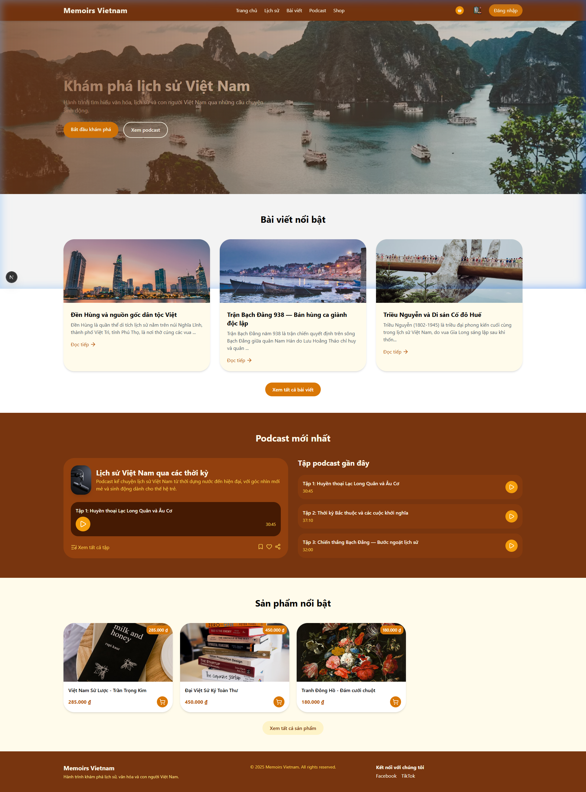
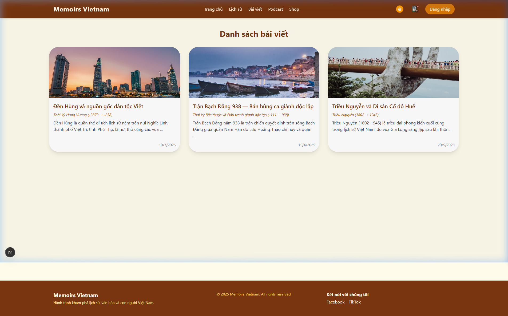
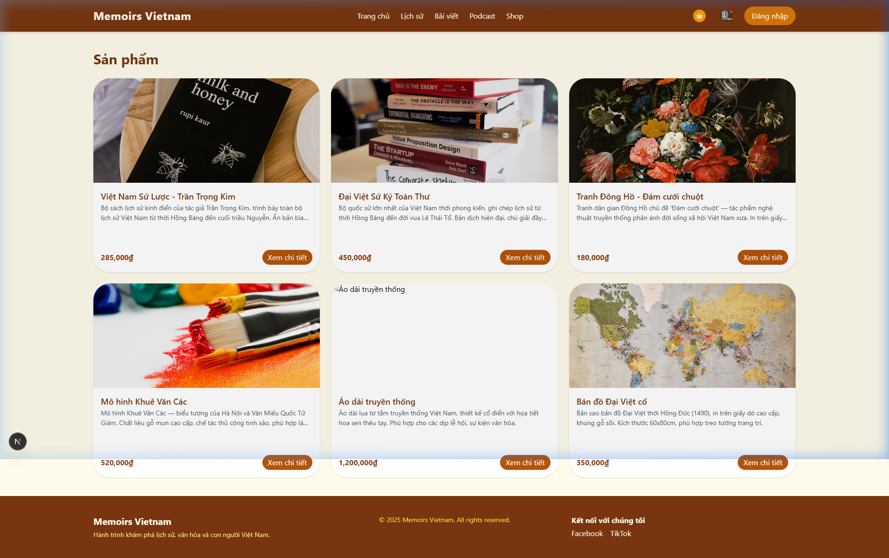
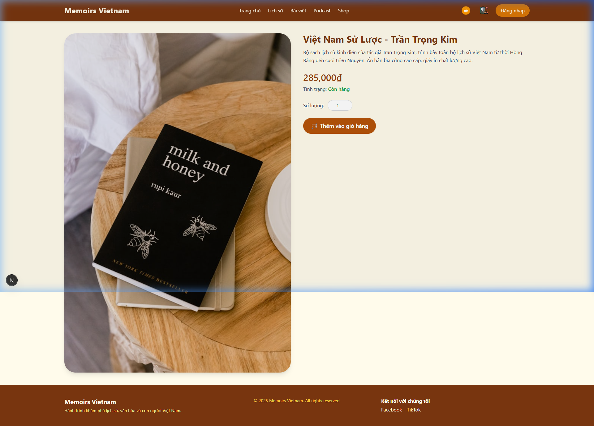
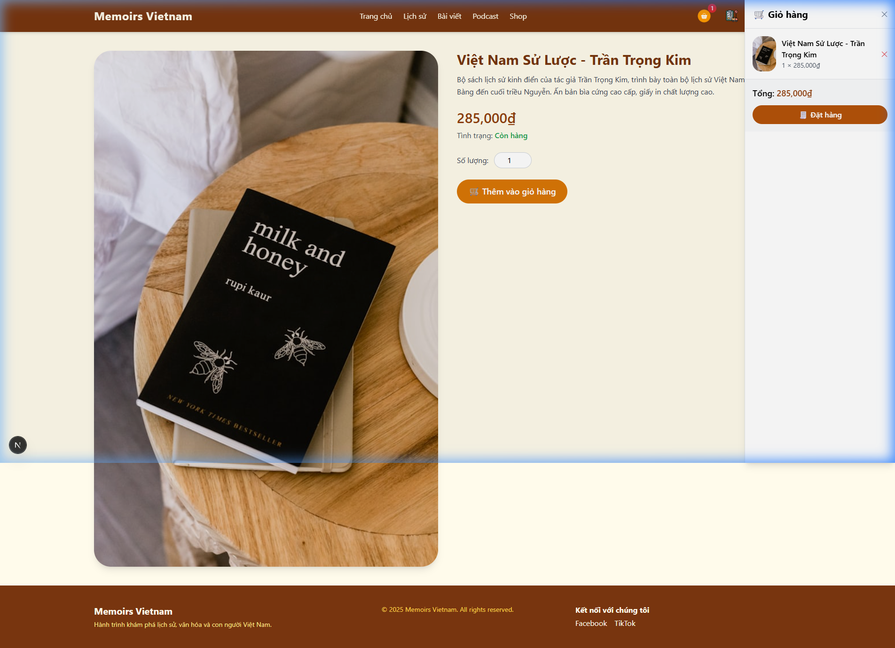
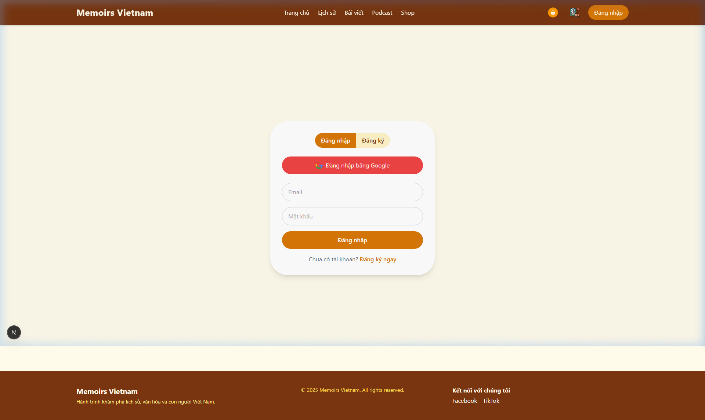
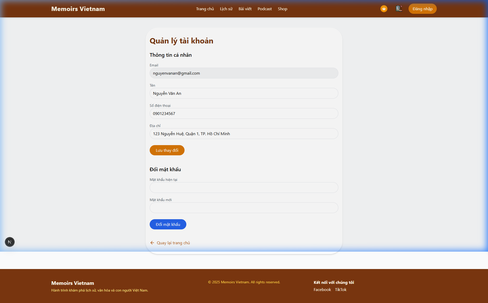
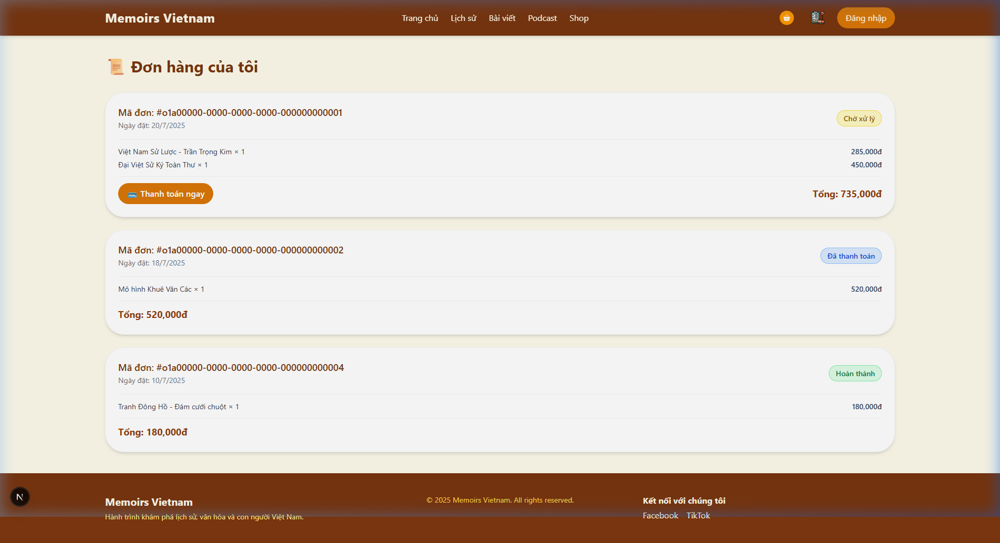

# 🇻🇳 Memories Vietnam - Frontend

<p align="center">
  A modern and responsive web application for exploring Vietnamese history through articles, podcasts, and an integrated online store.
</p>

<p align="center">


</p>

---

# 📖 Overview

**Memories Vietnam** is a modern web application that introduces Vietnamese history through an engaging digital experience.

The frontend provides a clean and responsive user interface where users can explore historical articles, listen to podcasts, browse educational products, manage personal accounts, and purchase history-related merchandise.

Built with **Next.js**, **React**, and **Tailwind CSS**, the project focuses on delivering a smooth user experience with responsive layouts and reusable components.

---

# ✨ Project Highlights

- 🎨 Modern UI built with Next.js & React
- 📱 Responsive design for multiple screen sizes
- 🔐 Authentication & User Account
- 📖 Historical Article Platform
- 🛍️ Integrated Online Store
- 🛒 Shopping Cart
- 📦 Order Management
- 👤 User Profile Management
- ⚡ REST API Integration with ASP.NET Core Backend

---

# 📸 Application Preview

## 🏠 Home Page

<p align="center">

</p>

---

## 📚 Historical Articles

<p align="center">

</p>

---

## 🛍️ Shop

<p align="center">

</p>

---

## 📦 Product Detail

<p align="center">

</p>

---

## 🛒 Shopping Cart

<p align="center">

</p>

---

## 🔐 Login

<p align="center">

</p>

---

## 👤 User Profile

<p align="center">

</p>

---

## 📋 Order History

<p align="center">

</p>

---

# ✨ Features

## 👤 User Authentication

- Login
- Register
- Google OAuth Login
- JWT Authentication
- Protected Routes

---

## 📖 Historical Content

- Browse Historical Articles
- Article Details
- Search Articles
- Categories & Tags

---

## 🎧 Podcast & Audio

- Podcast Listing
- Episode Details
- Audio Playback

---

## 🛍️ E-Commerce

- Product Catalog
- Product Details
- Shopping Cart
- Checkout
- Order History

---

## 👥 User Features

- User Profile
- Edit Profile
- View Orders
- Reading History
- Bookmarks

---

# 📱 Responsive Design

The application is designed with a responsive layout to provide a consistent user experience across desktop, tablet, and mobile devices.

---

# 📂 Project Structure

```text
src
├── app
├── components
├── hooks
├── layouts
├── lib
├── services
├── types
├── utils
├── styles
└── assets
```

| Folder | Description |
|---------|-------------|
| app | Application routing and pages |
| components | Reusable UI components |
| layouts | Shared page layouts |
| services | API communication |
| hooks | Custom React Hooks |
| utils | Utility functions |
| types | TypeScript definitions |
| styles | Global styles |

---

# 🛠️ Technology Stack

## Frontend

- Next.js
- React
- TypeScript
- Tailwind CSS

### State Management

- React Context API
- React Hooks

### API Communication

- Axios
- RESTful API

### Authentication

- JWT Authentication

### Deployment

- Vercel

### Development Tools

- Visual Studio Code
- Git & GitHub
- npm

---

# 🚀 Getting Started

## Prerequisites

- Node.js 20+
- npm / yarn / pnpm

---

## Clone Repository

```bash
git clone https://github.com/YOUR_USERNAME/MemoriesVietnamFE.git
```

---

## Install Dependencies

```bash
npm install
```

---

## Configure Environment

Create a `.env.local` file and configure the required environment variables.

Example:

```env
NEXT_PUBLIC_API_URL=YOUR_BACKEND_API
```

---

## Run Development Server

```bash
npm run dev
```

Open:

```
http://localhost:3000
```

---

## Build for Production

```bash
npm run build
```

---

# 🔗 Backend Repository

This frontend communicates with the **Memories Vietnam Backend API**.

Backend Repository:

https://github.com/HienDamHai/MemoriesVietnam

---

# 🚀 Future Improvements

- Dark Mode
- Multi-language Support
- Performance Optimization
- Progressive Web App (PWA)
- Better Accessibility
- Unit & E2E Testing

---

# 👨‍💻 Author

**Hien Dam**

Backend & Full-stack Developer

GitHub:

https://github.com/HienDamHai

---

⭐ If you found this project interesting, consider giving it a star.
